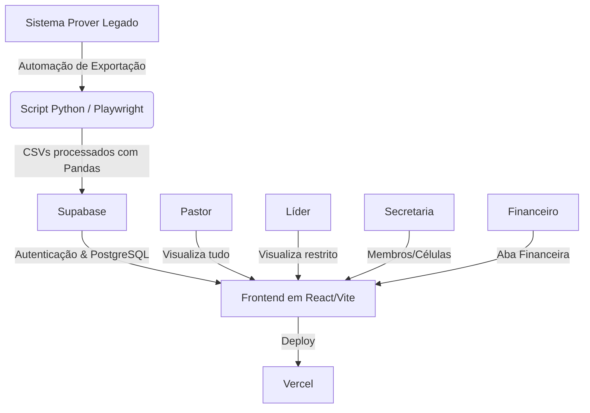

# Visão Geral do Produto (Product Overview) - IgrejaPro

## 1. O que é o IgrejaPro?
O **IgrejaPro** (ou *Prover Dashboard*) é um sistema inteligente de Business Intelligence (BI) e Gestão desenvolvido para auxiliar na administração e acompanhamento de atividades da igreja. Ele atua como uma camada de visualização avançada, consumindo e processando dados do sistema legado **Prover**.

O objetivo principal é modernizar a gestão e análise de dados, oferecendo um portal de acesso com perfis granulares (RBAC), estabilidade na visualização e rotinas de extração de dados automatizadas.

## 2. Principais Funcionalidades

### 📊 Dashboard Interativo
Visualizações ricas de indicadores como:
- Número total de Membros e Visitantes.
- Quantidade de Células (Grupos de Crescimento) e Discipulados ativos.
- Arrecadação financeira e saúde de caixas.

### 🛡️ Controle de Acesso Baseado em Perfis (RBAC)
Múltiplas visualizações baseadas na hierarquia do usuário logado:
- **Administrador / Pastor:** Visão 360º de todas as métricas, relatórios de secretaria e fluxo de caixa.
- **Secretaria:** Acesso aos dados completos de membros e células (sem acesso à aba financeira).
- **Financeiro:** Acesso exclusivo e completo aos módulos e relatórios financeiros.
- **Líder de Célula / Setor:** Visão restrita apenas aos dados dos membros pertencentes à sua célula ou setor, com funcionalidade de registro de presença e relatórios específicos da sua área.

### 🤖 Automação de Dados (ETL)
Como o sistema legado não fornece uma API acessível, o IgrejaPro conta com:
- **Scripts em Python (Playwright + Pandas):** Fazem login automático no sistema Prover, navegam até as páginas de exportação, e baixam planilhas completas de Membros, Células, Financeiro e Eventos.
- **Processamento:** Tratamento inteligente de duplicatas, normalização de nomes, verificação de consistência.
- **Sincronização Cloud:** Inserção (Upsert) dos dados estruturados no Supabase para alimentação em tempo real do Dashboard.

## 3. Arquitetura de Alto Nível

### Tecnologias Utilizadas
- **Frontend:** React, TypeScript, Vite, TailwindCSS (para UI e responsividade). Gráficos via Recharts.
- **Backend / DB / Autenticação:** Supabase (PostgreSQL, Supabase Auth).
- **Extração de Dados (ETL):** Python 3, Playwright (navegação headless), Pandas (processamento e limpeza).
- **Hospedagem (Deploy):** Vercel.
