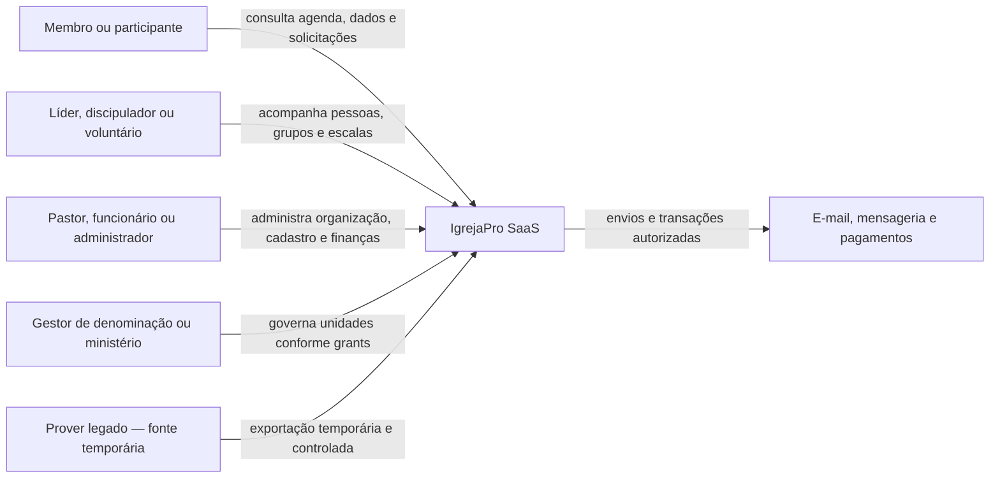
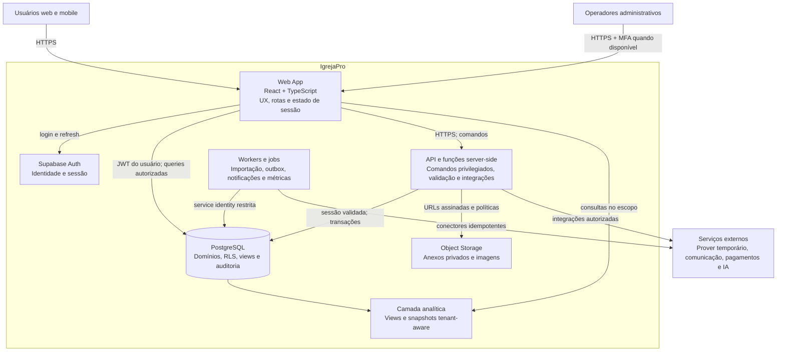

# C4 do IgrejaPro

Esta visão representa a arquitetura-alvo inicial. Elementos de billing e provedores externos são capacidades planejadas, não indicação de integração já implementada.

## Nível 1 — Contexto

## Nível 2 — Containers

## Limites e responsabilidades

- Web App não decide autorização final e nunca recebe service role.
- API é obrigatória para administração de usuários, grants, operações financeiras sensíveis, exportações e integrações.
- PostgreSQL é a última barreira de isolamento por meio de RLS forçado.
- Jobs usam identidades e permissões mínimas, com idempotência, correlação e auditoria.
- Storage é privado por padrão; acesso ocorre por policy ou URL assinada de curta duração.
- Analytics preserva `tenant_id`, escopo organizacional e regras de sensibilidade.
