# Modelo conceitual de dados

O diagrama é deliberadamente conceitual. Tipos, cardinalidades auxiliares e detalhes físicos serão definidos nas migrations de cada fatia.

```mermaid
erDiagram
    TENANT ||--o{ ORG_UNIT : contains
    ORG_UNIT ||--o{ ORG_UNIT : parent_of
    TENANT ||--o{ TENANT_MEMBERSHIP : admits
    USER_PROFILE ||--o{ TENANT_MEMBERSHIP : joins
    TENANT_MEMBERSHIP ||--o{ ACCESS_ASSIGNMENT : receives
    ROLE ||--o{ ACCESS_ASSIGNMENT : assigned_as
    ROLE ||--o{ ROLE_PERMISSION : includes
    PERMISSION ||--o{ ROLE_PERMISSION : grants
    ORG_UNIT ||--o{ ACCESS_ASSIGNMENT : scopes

    TENANT ||--o{ TENANT_RELATIONSHIP : source
    TENANT ||--o{ TENANT_RELATIONSHIP : target
    TENANT_RELATIONSHIP ||--o{ DATA_SHARING_GRANT : authorizes

    TENANT ||--o{ PERSON : owns
    ORG_UNIT ||--o{ ORGANIZATION_MEMBERSHIP : hosts
    PERSON ||--o{ ORGANIZATION_MEMBERSHIP : participates
    PERSON ||--o{ PERSON_CONTACT : has
    PERSON ||--o{ PERSON_ADDRESS : has
    PERSON ||--o{ PERSON_DOCUMENT : has
    HOUSEHOLD ||--o{ HOUSEHOLD_MEMBER : groups
    PERSON ||--o{ HOUSEHOLD_MEMBER : belongs
    PERSON ||--o{ LIFECYCLE_OCCURRENCE : follows
    PERSON ||--o{ CONSENT_RECORD : provides

    ORG_UNIT ||--o{ MINISTRY_GROUP : organizes
    MINISTRY_GROUP ||--o{ GROUP_MEMBERSHIP : includes
    PERSON ||--o{ GROUP_MEMBERSHIP : participates
    PERSON ||--o{ LEADERSHIP_ASSIGNMENT : serves
    MINISTRY_GROUP ||--o{ LEADERSHIP_ASSIGNMENT : led_by
    PERSON ||--o{ DISCIPLESHIP_RELATIONSHIP : disciple
    PERSON ||--o{ DISCIPLESHIP_RELATIONSHIP : discipler
    MINISTRY_GROUP ||--o{ MEETING : schedules
    MEETING ||--o{ ATTENDANCE : records
    PERSON ||--o{ ATTENDANCE : attends

    ORG_UNIT ||--o{ EVENT : promotes
    EVENT ||--o{ EVENT_SESSION : comprises
    EVENT ||--o{ REGISTRATION : accepts
    PERSON ||--o{ REGISTRATION : submits
    EVENT_SESSION ||--o{ SCALE_ASSIGNMENT : needs
    PERSON ||--o{ SCALE_ASSIGNMENT : serves

    TENANT ||--o{ FINANCIAL_ACCOUNT : owns
    ORG_UNIT ||--o{ COST_CENTER : owns
    FINANCIAL_ACCOUNT ||--o{ FINANCIAL_TRANSACTION : receives
    COST_CENTER ||--o{ FINANCIAL_TRANSACTION : classifies
    PERSON ||--o{ CONTRIBUTION : contributes
    FINANCIAL_TRANSACTION ||--o| CONTRIBUTION : represents

    MODULE_CATALOG ||--o{ PLAN_MODULE : offered_in
    PLAN ||--o{ PLAN_MODULE : contains
    TENANT ||--o{ SUBSCRIPTION : contracts
    PLAN ||--o{ SUBSCRIPTION : selected
    TENANT ||--o{ TENANT_ENTITLEMENT : overrides
    MODULE_CATALOG ||--o{ TENANT_ENTITLEMENT : enables

    TENANT ||--o{ IMPORT_JOB : executes
    IMPORT_JOB ||--o{ IMPORT_BATCH : divides
    IMPORT_BATCH ||--o{ IMPORT_ERROR : reports
    PERSON ||--o{ EXTERNAL_REFERENCE : maps
    TENANT ||--o{ AUDIT_EVENT : records
```

## Invariantes do modelo

- Entidades de negócio possuem UUID interno e `tenant_id`; IDs externos nunca são chave primária.
- Relações entre entidades tenant-scoped usam chaves que impeçam referência cruzada entre tenants.
- Pessoa é tenant-scoped. Vínculos da mesma pessoa em tenants distintos exigem consentimento e processo explícito.
- Dados sensíveis são separados por finalidade para permitir permissões, retenção e auditoria específicas.
- Exclusão de pessoa considera retenção legal, anonimização e integridade dos registros financeiros/auditoria.
- Relação federativa não equivale a autorização; somente um grant vigente permite a finalidade descrita.

## Agregados iniciais

| Agregado | Raiz | Responsabilidade |
|---|---|---|
| Tenant | `tenant` | contrato, configuração e fronteira de segurança |
| Organização | `org_unit` | hierarquia interna e escopos operacionais |
| Identidade e acesso | `tenant_membership` | vínculo, roles e atribuições de acesso |
| Pessoa e família | `person` / `household` | cadastro, relacionamentos, consentimento e jornada |
| Grupo ministerial | `ministry_group` | participação, liderança, encontros e presença |
| Evento | `event` | sessões, inscrições e escalas |
| Financeiro | `financial_transaction` | lançamentos, classificação e conciliação |
| Assinatura | `subscription` | plano e direitos de uso do tenant |
| Importação | `import_job` | staging, idempotência, reconciliação e erros |
