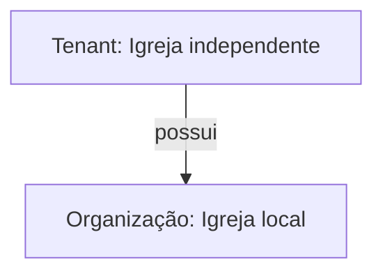
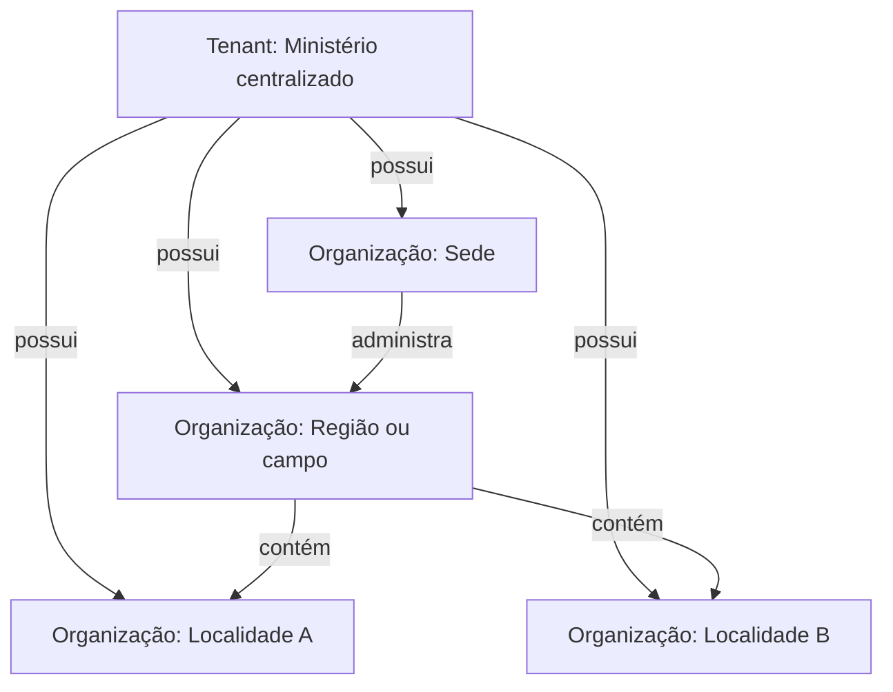
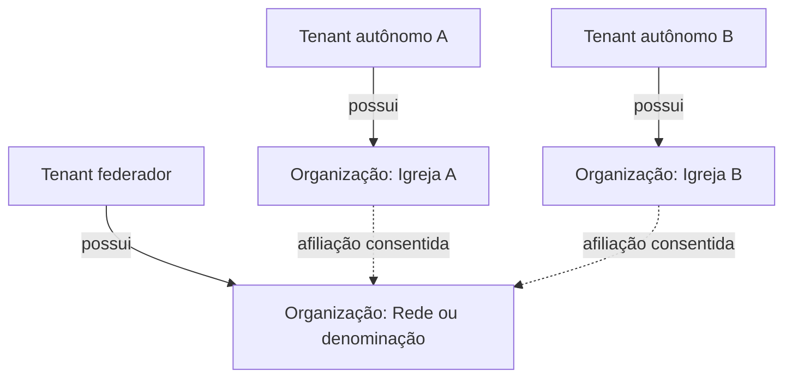

# Topologias organizacionais suportadas

Status: aprovado para a fundação da Sprint 0

Produto: IgrejaPro

## Objetivo

Definir três topologias canônicas que cubram uma igreja independente, uma estrutura centralizada e uma rede federada. Elas orientam o modelo de dados e os testes de isolamento; não representam planos comerciais.

## Regras comuns

- Toda organização pertence a exatamente um tenant.
- Relações dentro de um tenant podem representar administração e hierarquia.
- Relações entre tenants são afiliações consentidas, não hierarquias de propriedade de dados.
- Nenhuma relação concede acesso nominal automaticamente.
- Permissões sempre são avaliadas no contexto organizacional ativo.
- Relações possuem tipo, status e vigência.
- Relações hierárquicas não podem formar ciclos.
- Relatórios consolidados respeitam concessões de compartilhamento e granularidade.

## TOP-01 — Igreja independente

### Uso

Uma igreja local, comunidade ou ministério que administra seus próprios dados e não precisa representar unidades subordinadas.

### Características

- Um tenant e uma organização principal.
- Administração, membros, configurações e módulos pertencem ao mesmo tenant.
- Pode futuramente convidar uma congregação para o mesmo tenant ou aceitar afiliação federada.
- É a topologia padrão de onboarding.

### Exemplos de escopo

| Perfil | Escopo típico |
|---|---|
| Proprietário do tenant | Tenant inteiro |
| Administrador da igreja | Organização principal |
| Líder | Recurso ou ministério específico |
| Membro | Próprio cadastro e recursos publicados |

### Invariantes de aceite

- Não há registro operacional sem `tenant_id` válido.
- Um usuário externo não vê a organização nem seus cadastros sem participação ou publicação explícita.
- A futura criação de uma segunda organização não exige migração para outro produto ou banco.

## TOP-02 — Estrutura centralizada

### Uso

Uma igreja-sede administra congregações, localidades, campos ou unidades sob a mesma governança e contrato de dados.

### Características

- Um tenant contém várias organizações.
- A pessoa é canônica no tenant e pode possuir vínculos distintos com várias organizações.
- A sede pode receber permissões sobre uma subárvore, desde que isso seja explicitamente atribuído.
- Configurações podem futuramente ser herdadas, mas toda herança deve ser identificável e sobrescrita apenas quando permitido.

### Exemplos de escopo

| Perfil | Escopo típico |
|---|---|
| Administrador geral | Tenant inteiro |
| Supervisor regional | Subárvore da região |
| Pastor local | Uma organização local |
| Secretário local | Cadastros autorizados da localidade |

### Invariantes de aceite

- Organizações pertencem ao mesmo tenant, mas permissões locais continuam restritas por escopo.
- Uma relação hierárquica não pode apontar para si mesma nem fechar um ciclo.
- Mover uma organização na hierarquia não altera silenciosamente a propriedade dos registros.
- Relatórios centrais não podem ignorar o escopo do usuário que os executa.

## TOP-03 — Rede ou denominação federada

### Uso

Igrejas juridicamente ou administrativamente autônomas participam de uma rede, convenção, denominação ou ministério apostólico, mantendo tenants próprios.

### Características

- Cada igreja autônoma mantém propriedade e administração dos próprios dados.
- O tenant federador mantém sua organização e a referência às afiliações aceitas.
- Indicadores compartilhados podem ser agregados, anonimizados ou nominais, conforme concessão explícita.
- A liderança federadora não recebe acesso administrativo automático aos tenants afiliados.
- A igreja afiliada pode revogar compartilhamentos sem perder o histórico da afiliação.

### Exemplos de compartilhamento

| Caso | Padrão recomendado |
|---|---|
| Quantidade total de membros | Agregado |
| Crescimento por região | Agregado e temporal |
| Lista nominal de ministros credenciados | Nominal, finalidade e vigência explícitas |
| Conteúdo pastoral de membros | Não compartilhado por padrão |
| Prestação de contas | Conjunto de dados específico e auditado |

### Invariantes de aceite

- A consulta autenticada em um tenant não retorna registros operacionais de outro tenant.
- A afiliação depende de convite e aceite das partes autorizadas.
- A afiliação ativa sem concessão de compartilhamento expõe apenas metadados institucionais mínimos.
- A revogação encerra novos acessos e preserva evidências de auditoria.
- Processos privilegiados multitenant exigem identidade de serviço, finalidade e rastreabilidade.

## Transições suportadas

### Independente para centralizada

A organização cria novas unidades no mesmo tenant. A operação não exige copiar o cadastro canônico de pessoas.

### Independente para federada

A organização mantém seu tenant e aceita uma afiliação. Nenhum dado operacional é transferido implicitamente.

### Centralizada para autonomia

Separar uma organização em novo tenant é uma operação futura de cisão de dados, com autorização, inventário, exportação, reconciliação e auditoria. Não é uma simples alteração de `tenant_id`.

### Federada para centralizada

Unificar tenants exige projeto de migração e governança de dados. Aceitar uma afiliação não autoriza a unificação.

## Decisões adiadas, mas não ignoradas

- Herança configurável de nomenclaturas e políticas.
- Fluxo completo de convite e aceite de afiliação.
- Catálogo de indicadores federados.
- Cisão e fusão de tenants.
- Cobrança centralizada de organizações autônomas.
- Delegação temporária de suporte entre tenants.
