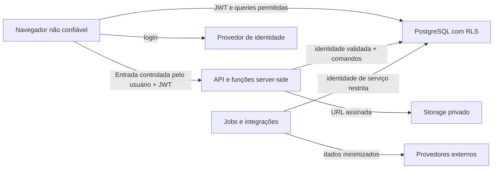

# Threat model inicial do IgrejaPro

- Versão: 0.1
- Data: 2026-07-15
- Escopo: fundação SaaS multitenant, cadastro mínimo, autenticação, autorização, importação e relatórios
- Método: STRIDE orientado a ativos e fronteiras de confiança

## Objetivos de segurança

1. Um tenant nunca acessa dados de outro sem grant explícito, vigente e compatível com a finalidade.
2. Usuários acessam apenas ações e subárvores organizacionais atribuídas.
3. Dados pessoais, pastorais e financeiros são minimizados, protegidos e auditáveis.
4. Uma falha no frontend não elimina a proteção do banco/API.
5. Importações, integrações e jobs não ampliam privilégios nem misturam tenants.
6. Toda operação administrativa ou sensível pode ser atribuída a ator, tenant, finalidade e instante.

## Ativos protegidos

| Ativo | Sensibilidade | Exemplos de impacto |
|---|---|---|
| Identidade e sessão | Crítica | tomada de conta e elevação de privilégio |
| Cadastro pessoal e familiar | Alta | exposição de crianças, contatos e endereços |
| Cuidado pastoral e discipulado | Muito alta | dano espiritual, reputacional e discriminação |
| Contribuições e financeiro | Muito alta | fraude, exposição patrimonial e dano contábil |
| Grants, roles e entitlements | Crítica | acesso transversal ou uso indevido do produto |
| Documentos e anexos | Alta | vazamento de identidade e documentos legais |
| Logs e auditoria | Alta | ocultação de incidente ou exposição secundária |
| Segredos de integração | Crítica | comprometimento de Prover, GitHub, IA ou comunicação |
| Disponibilidade e backups | Alta | interrupção operacional e perda de histórico |

## Fronteiras de confiança

Tudo vindo do navegador, arquivo importado, webhook ou provedor externo é não confiável até validação. Service role ultrapassa RLS e, portanto, não pode chegar ao navegador ou ser usada por operações genéricas.

## Ameaças e controles

| ID | STRIDE | Ameaça | Controle preventivo | Evidência/teste esperado | Risco residual |
|---|---|---|---|---|---|
| T01 | Spoofing | uso de sessão roubada | TLS, tokens curtos/refresh, revogação, MFA para administradores quando disponível, proteção XSS | sessão revogada deixa de operar; smoke de autenticação | Médio |
| T02 | Tampering | cliente altera `tenant_id` no payload | tenant derivado do contexto autorizado; FK tenant-aware; RLS `WITH CHECK` | usuário A não insere nem move registro para B | Baixo |
| T03 | Repudiation | administrador nega alteração de role/grant | audit log append-only com ator, alvo, tenant, request/correlation ID e before/after minimizado | evento gerado para toda mutação IAM | Baixo |
| T04 | Information disclosure | policy ausente expõe outro tenant | RLS habilitado e forçado, negação por padrão, lint de tabelas e testes A×B | SELECT de A sobre B retorna zero/nega | Baixo após automação |
| T05 | Information disclosure | vínculo denominacional concede acesso implícito | relationship sem permissão; grant explícito por finalidade/escopo/validade | relacionamento isolado não altera resultados | Baixo |
| T06 | Elevation of privilege | papel forjado em `user_metadata` | autorização consulta membership/assignments no banco; metadata não confiável | JWT com metadata adulterada continua negado | Baixo |
| T07 | Elevation of privilege | função `SECURITY DEFINER` genérica contorna RLS | funções mínimas, search_path fixo, validação do ator, revoke PUBLIC, sem SQL arbitrário | revisão estática e teste anon/auth sem permissão | Médio |
| T08 | Information disclosure | arquivo PII publicado ou incluído no build | proibir dados reais em `public/`, fixtures sintéticas, secret/PII scan e revisão de artefatos | build não contém datasets reais | Baixo |
| T09 | Information disclosure | anexos previsíveis ou bucket público | bucket privado, path tenant-aware, URLs assinadas curtas, validação de MIME/tamanho | A não baixa objeto de B; URL expira | Baixo |
| T10 | Tampering | importação mistura ou sobrescreve tenants | staging tenant-scoped, external reference composta, idempotency key, dry-run e reconciliação | reprocessar batch não duplica; mismatch é rejeitado | Baixo |
| T11 | Denial of service | exportação/relatório amplo esgota banco | paginação, limites, timeout, rate limit, filas, materializações e quotas | teste de limite e cancelamento | Médio |
| T12 | Information disclosure | logs contêm PII, tokens ou payloads | logging estruturado com allowlist/redaction; retenção e acesso restritos | teste impede campos sensíveis no logger | Baixo |
| T13 | Tampering | webhook falso altera dados/billing | assinatura, timestamp, replay protection e idempotência | assinatura inválida/replay são negados | Baixo |
| T14 | Elevation of privilege | service role usada em endpoint genérico | funções administrativas específicas, bearer validado, permission check e rate limit | endpoint sem permissão falha mesmo autenticado | Médio |
| T15 | Information disclosure | analytics agrega dados fora do escopo | views security-invoker ou RPC tenant-aware; supressão de pequenos grupos quando necessário | métricas A não mudam com seed de B | Baixo |
| T16 | Tampering | usuário altera lançamento já conciliado | state machine, autorização separada, versão/lock otimista e auditoria | transição inválida é negada | Baixo |
| T17 | Repudiation | consentimento LGPD sem prova | versão do termo, finalidade, timestamp, canal, ator/responsável e evidência imutável | histórico não é sobrescrito | Baixo |
| T18 | Denial of service | dependência externa indisponível bloqueia operação | timeout, retry com backoff, circuit breaker lógico, outbox e DLQ | falha externa não perde comando local | Médio |
| T19 | Spoofing | account enumeration/reset abusivo | mensagens neutras, rate limit, token único/curto e auditoria | resposta não revela existência de conta | Baixo |
| T20 | Information disclosure | cache/localStorage mantém dado pastoral | não persistir PII sensível no localStorage; limpar sessão; cache server-side tenant-aware | inspeção do storage após logout | Baixo |

## Invariantes verificáveis

- Toda tabela tenant-scoped tem `tenant_id NOT NULL`, RLS habilitado e RLS forçado.
- Toda policy possui condição de leitura e `WITH CHECK` quando há escrita.
- Não existe `GRANT` de PII para `anon`.
- Nenhuma função que aceita SQL arbitrário é executável por usuário final.
- Uma membership suspensa invalida acesso sem depender de novo deploy.
- `tenant_relationship` sozinho nunca muda permissão efetiva.
- Entitlement não substitui permissão: ambos precisam permitir a ação.
- Operação com service role sempre registra ator/finalidade e nunca aceita tenant arbitrário sem validação.
- Dados de teste são sintéticos e não derivam de pessoas reais.

## Cenários mínimos de teste de segurança

1. Administrador A executa CRUD apenas em A; administrador B executa CRUD apenas em B.
2. Líder A enxerga sua unidade e descendentes, mas não irmãos, ancestrais não concedidos ou outro tenant.
3. Usuário anônimo e autenticado sem membership recebem zero dados e não escrevem.
4. Usuário suspenso perde leitura e escrita.
5. Role sem `people.person.sensitive.read` não acessa documentos, cuidado ou contatos protegidos.
6. Módulo desabilitado é negado na API/RPC mesmo com rota acessada manualmente.
7. Grant federado expirado ou revogado deixa de autorizar imediatamente.
8. Tentativas negadas relevantes geram telemetria sem registrar o conteúdo sensível.
9. Backup restaurado em ambiente isolado preserva tenant IDs, policies e auditoria.
10. Remover uma policy no teste faz a suíte de conformidade falhar.

## Riscos aceitos temporariamente

- Free tiers não garantem capacidade ou recuperação compatíveis com grandes denominações. Gatilhos de upgrade precisam ser definidos antes de clientes maiores.
- O legado continuará coexistindo durante a migração. Ele será tratado como fonte temporária e não como fronteira de autorização do SaaS.
- MFA pode depender do plano/provedor; até sua adoção, administradores exigem senha forte, sessão curta e monitoramento reforçado.

## Revisão

Revisar este documento a cada novo módulo, integração externa, classe de dado sensível, incidente, alteração de tenancy ou mudança substancial de infraestrutura.
