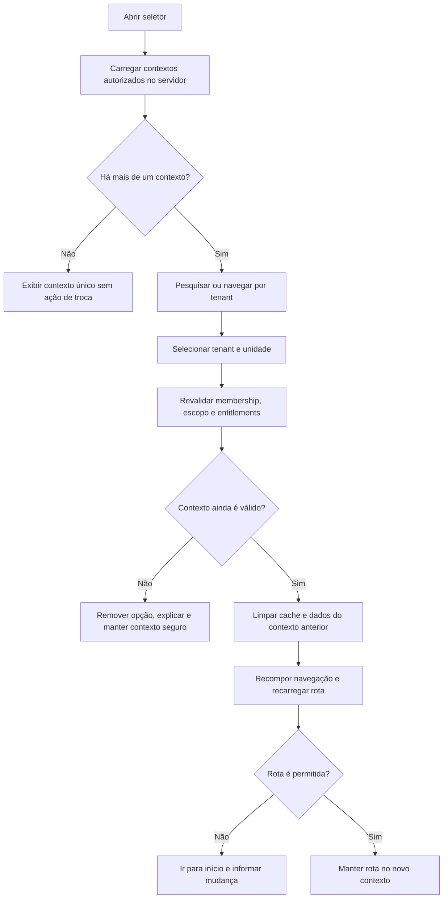

# Sprint 1 — Especificação UX do core shell

Status: contrato de experiência para design e implementação

Referência funcional: `docs/product/sprint-01-user-stories.md`

## Objetivo de experiência

Permitir que responsáveis e administradores configurem e operem o núcleo do IgrejaPro com clareza de contexto. A interface deve responder continuamente a três perguntas:

1. Em qual tenant e organização estou?
2. O que posso fazer neste contexto?
3. O que acontecerá se eu alterar estrutura ou acesso?

## Arquitetura de navegação

### Áreas autenticadas

| Área | Entrada | Visibilidade mínima |
|---|---|---|
| Início | `/app` | membership ativa |
| Onboarding | `/onboarding` | responsável autorizado e onboarding incompleto |
| Organizações | `/admin/organizations` | leitura da estrutura; ações exigem administração |
| Usuários | `/admin/users` | `users.read`; mutações exigem `users.manage` |
| Papéis e acessos | `/admin/access` | leitura autorizada; customização exige gestão de IAM |
| Módulos e limites | `/admin/modules` | responsável ou administrador autorizado |
| Auditoria | `/admin/audit` | `audit.read` |
| Meu perfil | `/account` | usuário autenticado |

As rotas são nomes conceituais. O frontend pode adaptar sua estrutura, mas deve manter URLs estáveis, compartilháveis dentro da mesma autorização e protegidas por guards server-side.

## Shell autenticado

### Desktop

Estrutura:

```text
┌──────────────────────────────────────────────────────────────┐
│ IgrejaPro  [Tenant / Unidade ▾]          Ajuda  Perfil ▾     │
├──────────────┬───────────────────────────────────────────────┤
│ Início       │ Breadcrumb                                   │
│              │ Título                         Ação primária   │
│ Administração│ Contexto/descrição da página                  │
│ Organizações │                                               │
│ Usuários     │ Conteúdo                                      │
│ Acessos      │                                               │
│ Módulos      │                                               │
│ Auditoria    │                                               │
└──────────────┴───────────────────────────────────────────────┘
```

- topo fixo contém marca provisória, seletor de contexto e menu de conta;
- navegação lateral apresenta apenas entradas disponíveis no contexto;
- nome do tenant nunca deve ser truncado sem tooltip ou acesso ao nome completo;
- título de página, breadcrumb e ação primária permanecem no conteúdo, não na navegação;
- mudança de contexto deve ser visualmente perceptível sem depender apenas de cor.

### Mobile

- cabeçalho mostra unidade ativa em uma linha e tenant em texto auxiliar;
- menu lateral vira drawer acionável por botão rotulado;
- seletor de contexto abre tela/modal de largura total;
- ações primárias ficam no fluxo do conteúdo; botão flutuante só quando houver uma única ação inequívoca;
- tabelas administrativas usam cartões ou colunas prioritárias, com ações em menu contextual;
- nenhuma ação crítica depende de hover.

## Seletor global de contexto

### Conteúdo

- contexto atual: tenant, unidade e, quando útil, tipo da unidade;
- pesquisa por nome apenas sobre contextos já autorizados;
- agrupamento por tenant;
- unidades apresentadas em hierarquia ou com caminho, por exemplo `Sede / Região Norte / Localidade A`;
- indicação de contexto sem acesso operacional, suspenso ou expirado somente quando necessário para explicar a indisponibilidade;
- ação “Administrar contextos” apenas para quem possui acesso correspondente.

### Fluxo



### Estados

| Estado | Tratamento |
|---|---|
| Carregando | skeleton curto; seletor não aceita confirmação |
| Um contexto | exibir identidade do contexto; ocultar affordance enganosa de troca |
| Vários contextos | pesquisa, agrupamento e seleção por teclado |
| Nenhum contexto ativo | página dedicada “Seu acesso ainda não está ativo” |
| Contexto revogado durante uso | limpar dados, bloquear ação e redirecionar para contexto válido |
| Falha de rede | manter contexto visualmente marcado como não revalidado e bloquear mutações até confirmação |

O armazenamento local pode guardar somente o identificador preferido. Nome, árvore e permissões são sempre reobtidos do servidor.

## Onboarding

### Stepper

| Etapa | Conteúdo | Pode pular? |
|---|---|---|
| 1. Boas-vindas | objetivo, duração aproximada e condição de responsável | Não |
| 2. Organização | nome, tipo, identificador amigável e localização básica | Não |
| 3. Estrutura | independente ou centralizada; unidades iniciais | Unidades adicionais, sim |
| 4. Equipe | convites com papel e escopo | Sim |
| 5. Módulos | capacidades habilitadas e limites, somente leitura | Não |
| 6. Revisão | resumo, alertas e confirmação | Não |

### Regras de interação

- progresso salvo após cada etapa confirmada;
- “Salvar e sair” permanece disponível, exceto durante submissão;
- voltar não duplica entidades nem perde dados já aceitos;
- saída mostra onde o fluxo será retomado;
- erro de campo aparece junto ao campo e em resumo acessível no topo;
- falha parcial distingue conteúdo salvo de ação não concluída;
- etapa de equipe não define senha e não presume que convite foi aceito;
- tela de módulos explica “disponibilidade comercial” versus “acesso do usuário”.

### Revisão final

Mostrar:

- tenant e organização principal;
- topologia escolhida e quantidade de unidades;
- convites pendentes e respectivos escopos;
- módulos habilitados;
- avisos que não impedem conclusão;
- botão “Concluir configuração” com confirmação explícita.

Não mostrar dados internos como UUID, policies ou detalhes técnicos de assinatura.

## Tela Início

Objetivo: confirmar contexto e orientar a próxima ação, sem inventar dashboards de módulos ainda não entregues.

Componentes:

- saudação e caminho completo do contexto;
- cartão de progresso do onboarding enquanto incompleto;
- atalhos autorizados: estrutura, convidar equipe, revisar acessos;
- resumo de módulos ativos;
- atividade administrativa recente somente para quem pode consultar auditoria;
- estados futuros dos módulos em linguagem neutra, sem prometer datas.

Estado vazio inicial: “Sua estrutura está pronta para começar” com uma única próxima ação relevante.

## Administração de organizações

### Visão em árvore

- árvore à esquerda ou em área principal, com busca e expansão progressiva;
- painel de detalhes da unidade selecionada;
- cada nó mostra nome, tipo e status;
- ações contextuais: adicionar filha, editar, mover e inativar, conforme permissão;
- caminho completo permanece visível em estruturas profundas;
- seleção não implica permissão de edição.

### Criar/editar unidade

Campos mínimos:

| Campo | Regra UX |
|---|---|
| Nome | obrigatório, tamanho e caracteres validados |
| Tipo | seleção do catálogo permitido pelo produto |
| Organização pai | somente opções válidas e autorizadas |
| Status | ativo/inativo com explicação do efeito |
| Vigência | opcional quando suportada, com validação temporal |

O formulário informa que inativar não apaga histórico. Alterar pai não é uma edição comum: abre o fluxo específico de movimentação.

### Mover unidade

Modal ou página de confirmação contendo:

- caminho atual;
- novo caminho;
- quantidade de unidades descendentes afetadas;
- aviso de que escopos derivados serão recalculados;
- confirmação textual para mudanças de alto impacto;
- resultado com correlação em caso de falha.

Pais inválidos não aparecem como selecionáveis. A validação server-side continua obrigatória.

### Estados vazios e erros

- sem filhas: “Esta unidade ainda não possui unidades vinculadas”; mostrar criação somente quando permitida;
- busca sem resultado: mensagem local, sem sugerir existência fora do escopo;
- conflito de versão: apresentar dados atualizados e solicitar revisão;
- ciclo ou pai inválido: explicar a regra em linguagem de negócio;
- unidade inativa: badge, contexto informativo e ações reduzidas.

## Administração de usuários

### Lista

Colunas prioritárias:

- nome de exibição ou e-mail mascarado quando apropriado;
- estado da membership;
- papéis ativos;
- escopo resumido;
- vigência;
- última alteração administrativa, não “último acesso” se o dado não existir.

Filtros: busca, estado, papel, unidade e vigência. A busca nunca consulta identidades globais fora do tenant.

### Convidar usuário

Fluxo em painel ou página:

1. e-mail;
2. papel inicial;
3. escopo: tenant, unidade ou subárvore permitida;
4. vigência opcional;
5. revisão e envio.

Antes de enviar, mostrar em frase legível: “Esta pessoa receberá o papel **Liderança local** em **Sede / Localidade A**”.

Estados especiais:

- já convidado: oferecer reenvio se permitido;
- já ativo: direcionar para edição de acessos, sem duplicar vínculo;
- limite atingido: explicar o limite e preservar o formulário sem sugerir bypass;
- envio pendente: impedir clique duplicado;
- falha do provedor: membership e envio devem permanecer reconciliáveis.

### Detalhe do usuário

Abas ou seções:

- visão geral da membership;
- atribuições de acesso;
- histórico administrativo permitido;
- ações: reenviar, suspender, reativar ou encerrar, conforme estado.

Suspender e encerrar exigem motivo. Encerrar usa linguagem distinta de excluir. A interface bloqueia a remoção do último responsável e oferece fluxo de transferência.

## Papéis e atribuições

### Lista de papéis

- separar templates do sistema e papéis personalizados;
- mostrar quantidade de permissões e usuários atribuídos;
- não reduzir acesso a rótulos eclesiásticos;
- papel de sistema possui badge e ações limitadas.

### Editor de papel

Componentes:

- nome e descrição;
- permissões agrupadas por domínio;
- pesquisa dentro do catálogo;
- descrição humana de cada permissão;
- indicação de sensibilidade;
- resumo das mudanças antes de salvar.

Permissões sensíveis exigem confirmação adicional. Não haverá campo livre para criar código de permissão.

### Atribuir acesso

- selecionar usuário com membership do tenant;
- selecionar papel;
- selecionar tipo e alvo do escopo;
- definir vigência;
- revisar acesso efetivo em linguagem humana;
- impedir combinação intertenant ou delegação fora do alcance do administrador.

Quando possível, apresentar “Por que este usuário tem acesso?” como composição de papel, permissão, escopo, membership e entitlement.

## Módulos e limites

### Cards ou tabela

Cada módulo mostra:

- nome e descrição;
- estado comercial;
- início e término quando temporário;
- limites conhecidos e consumo, se disponível;
- mensagem “Permissões de usuário continuam sendo necessárias”.

Estados visuais:

- ativo;
- trial com data final;
- carência;
- suspenso, com dados preservados;
- expirado.

Não incluir edição de plano, preço ou checkout. Quando uma capacidade não estiver disponível, usar chamada neutra para contato administrativo, sem botão falso de compra.

## Auditoria

### Lista de eventos

Filtros:

- intervalo de datas;
- ator;
- categoria;
- recurso;
- identificador de correlação.

Colunas:

- data/hora com fuso explícito;
- ator ou processo de serviço;
- ação em linguagem humana;
- recurso;
- organização quando aplicável;
- resultado.

### Detalhe do evento

- resumo da ação;
- metadados de rastreabilidade;
- comparação antes/depois com campos sensíveis mascarados;
- nenhuma ação de editar ou excluir;
- copiar correlação sem copiar payload pessoal.

Estado vazio deve diferenciar “nenhum evento no filtro” de “auditoria ainda sem eventos”. Falha não deve sugerir ausência de atividade.

## Estados globais

### Carregamento

- skeleton replica a estrutura, não conteúdo falso;
- mutações apresentam progresso no controle acionado;
- não substituir toda a página quando apenas um painel está atualizando;
- troca de contexto bloqueia interação até a limpeza e revalidação terminarem.

### Vazio

- explicar por que está vazio;
- oferecer no máximo uma ação primária e uma alternativa;
- esconder criação quando falta permissão, sem confundir ausência de permissão com erro.

### Sem permissão

- título: “Você não tem acesso a esta área neste contexto”;
- informar tenant/unidade atuais;
- oferecer voltar ao início ou trocar contexto, quando houver outro;
- não revelar nomes, contagens ou existência de recursos protegidos.

### Módulo indisponível

- explicar que a capacidade não está habilitada para o tenant;
- diferenciar de falta de permissão;
- não apresentar dados do módulo em background;
- manter opções legais de exportação em fluxo próprio quando aplicável.

### Tenant suspenso ou encerrado

- interromper mutações e limpar conteúdo operacional já carregado;
- mensagem institucional sem expor motivo financeiro a usuários comuns;
- responsável autorizado pode receber orientação administrativa;
- nunca indicar que os dados foram apagados.

### Sessão expirada

- solicitar nova autenticação;
- preservar apenas rota e rascunho não sensível quando seguro;
- após autenticar, revalidar contexto em vez de restaurá-lo cegamente.

### Operação concorrente

- não sobrescrever silenciosamente;
- apresentar quem/quando alterou somente se autorizado;
- oferecer recarregar e reaplicar a intenção.

## Confirmações e feedback

| Ação | Padrão |
|---|---|
| Criar/editar item comum | feedback inline e toast não exclusivo |
| Mover subárvore | confirmação com origem, destino e impacto |
| Suspender membership | confirmação, motivo obrigatório e efeito imediato |
| Encerrar membership | linguagem irreversível no fluxo comum e motivo obrigatório |
| Alterar permissão sensível | revisão de diff e confirmação adicional |
| Concluir onboarding | resumo completo e confirmação |

Toasts nunca são o único local de um erro importante. Mensagens devem incluir um identificador de suporte/correlação quando houver falha inesperada.

## Acessibilidade

- navegação completa por teclado;
- foco devolvido ao acionador ao fechar modal/drawer;
- foco levado ao título ou resumo de erro após navegação/submissão;
- árvore organizacional segue padrão ARIA tree ou alternativa hierárquica acessível;
- stepper comunica etapa atual e total;
- badges não dependem apenas de cor;
- contraste mínimo WCAG AA;
- alvos de toque adequados em mobile;
- mudanças de contexto e resultado de mutações anunciados por região viva sem excesso;
- datas, escopos e permissões permanecem compreensíveis com zoom de 200%.

## Conteúdo e terminologia

- usar “organização” para entidade administrativa e “tenant” apenas em conteúdo técnico ou quando necessário;
- usar “papel de acesso” para diferenciar de função ministerial;
- usar “unidade” como termo genérico configurável para sede, igreja, região ou localidade;
- usar “suspender” para bloqueio temporário e “encerrar vínculo” para término;
- não usar “excluir usuário” quando a operação real é encerrar membership;
- não chamar entitlement de permissão;
- manter IgrejaPro como nome provisório nesta Sprint.

## Telemetria de experiência

Eventos de produto não podem conter e-mail, nome, payload de auditoria ou outro PII. Medir:

- início, abandono, retomada e conclusão de cada etapa do onboarding;
- duração por etapa;
- falhas por categoria técnica, sem payload pessoal;
- uso do seletor e falha de revalidação de contexto;
- convite criado, reenviado, aceito, expirado ou recusado por identificadores não pessoais;
- conflitos ao mover unidades;
- frequência de telas sem permissão ou módulo indisponível.

## Critérios de aceite UX

- os fluxos J01 a J05 são executáveis em desktop e viewport mobile;
- contexto ativo permanece visível em todas as áreas autenticadas;
- teste com dois tenants demonstra limpeza visual e de dados após troca;
- onboarding pode ser interrompido e retomado sem duplicidade;
- estados loading, vazio, erro, sem permissão, suspenso e concorrência têm representação implementada;
- árvore, seletor e stepper passam navegação por teclado;
- ações destrutivas ou de alto impacto apresentam consequência antes da confirmação;
- linguagem diferencia tenant, organização, papel, função, entitlement e permissão;
- nenhum componente sugere que ocultar uma ação substitui autorização server-side.
